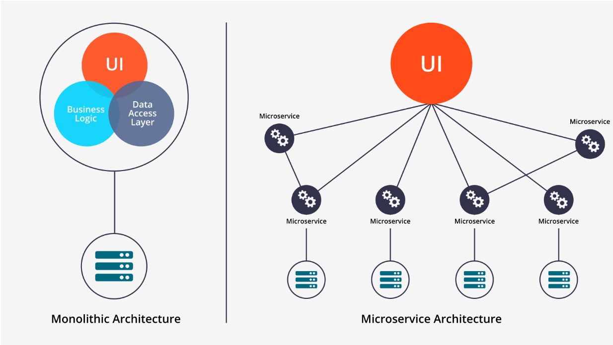

# Cloud Native Architecture - 16%
This part of the repository demonstrates the **Cloud Native Architecture** part of exam objectives, which covers 22% of the KCNA exam.

---

## Chapter outcomes
At the end of this page you should be able to:
- Explain how the Cloud Native Computing Foundation (CNCF) defines the Cloud Native terms and their core characteristics.
- Describe monolith vs. microservices architecture approaches with examples as well as the benefits and drawbacks of both approaches.
- Describe different autoscaling options in Cloud Native environments.
- Describe the concept and benefits of serverless computing.
- Explain community and governance 
- Explain the roles and personas that exist within Cloud Native environments and their corresponding tasks?
- Describe which open standards are available in Cloud Native world and what they are used for?

---

## What is Cloud Native?
CNCF defines the term Cloud Native as follows:

*“Cloud Native technologies empower organizations to build and run scalable applications in modern, dynamic environments such as public, private, and hybrid clouds.
**Containers, service meshes, microservices, immutable infrastructure, and declarative APIs** exemplify this approach. These techniques enable loosely coupled systems that are resilient, manageable, and observable. Combined with robust automation, they allow engineers to make high-impact changes frequently and predictably with minimal toil. [...]”* - ***CNCF***

---

## Describe monolithic vs. microservices architecture approaches as well as their benefits and drawbacks
- **Monolithic**
Monolithic applications are self-contained and include all the functionality and components in a single application, e.g., an E-Commerce application that consists of an online shop, GUI, products, shopping cart, order process, etc.
  - **Benefits**
    - Suitable for scenarios in which the application has different modules entirely dependent on each other from a transactional context.
    - Useful for simple and lightweight applications.
  - **Drawbacks**
    - Increased complexity due to tight coupling of all components.
    - Decreased reliability since all modules are running within the same process. A bug, such as a memory leak, in any module can affect the entire process.
    - Harder to handle when development is spread across multiple teams.
    - Harder to implement continuous integration and continuous deployment.
    - Extremely difficult to adopt new frameworks.
    - Difficult or impossible to scale out the application when load increases.

- **Microservices**
Microservices are an architectural approach for designing an application as a collection of small services; each service implements business logic or functionalities, runs in an isolated process, and communicates via HTTP APIs or messaging.
  - **Benefits**
    - Much faster to develop and much easier to understand and maintain.
    - Each services can be deployed, upgraded, scaled, and restarted independently of other services in the same application.
    - Enables frequent updates and continuous deployment.
    - Each service can be implemented with the most suitable technologies for the give problem domain.
    - Excellent choice for complex and evolving systems.
  - **Drawbacks**
    - Increased complexity due to more "moving parts" (i.e., multiple service must be integrated).
    - Partitioned database architecture and eventual consistency.
    - Testing is more complex.  
      E.g., a modern framework such as Spring Boot makes it trivial to write a test class that starts up a monolithic web application and tests its REST API. In contrast, a similar test class for a service would need to launch that service and any services that it depends upon.
    - Implementing changes that span multiple services can be hard (but happens rarely).
    - Successfully deploying a microservices application requires greater control of deployment methods and a higher level of automation.

    

---

## What are Cloud Native characteristics?
- **High-level Automation**
  - In every step from development to deployment (CI/CD, IaC, etc.)
  - Minimal human involvement
  - **Benefits:** fast and frequent incremental changes to production, easier disaster recovery, etc.
- **Self-healing**
  - Health check, monitoring, automatic restart, graceful service degradation, etc.
  - **Benefits:** if one Microservice fails, only this part of the application stops working and will be fixed.
- **Scalable**
  - It automatically scales the underlined resources of the application based on CPU, memory, etc.
  - **Benefits:** ensures availability, better performance, etc.
- **(Cost-) Efficient**
  - Scale up/down based on the application traffic
  - **Benefits:** efficient usage of infrastructure resources
- **Easy to maintain**
  - Using Microservices allows us to break down applications into smaller pieces.
  - **Benefits** more portable, easier to test and to distribute across multiple teams
- **Secure by default**
  - Many customers use cloud environments, and cloud providers secure data at rest.
   - **Benefits:** the customer doesn't have to cover all physical securities.

---

## Describe the Twelve-Factor-App
The Twelve-Factor-App is a development methodology for building Cloud Native applications that 
- uses declarative formats
- offers maximum portability
- is suitable for deployment on cloud platforms
- minimizes divergence between development and production
- enables continuous deployments for maximum agility
- allows easy scaling of applications without significant changes to tooling, architecture, or development practices

For more details about the twelve-factor app visit [The Twelve-Factor App](https://12factor.net/).

---

## Describe the autoscaling pattern with an example
Autoscaling describes the dynamic adjustment of resources based on the current demand. Typical metrics include CPU and memory usage, but time and business metrics can also be considered.
There are two types of autoscaling:
- **Vertical scaling:** Adding more CPU and memory to existing VMs.
- **Horizontal scaling:** Adding more physical or virtual machines.
- **The difference in example**
  - Build up muscle to carry a heavy object —> *Vertical*
  - Carry a heavy object together with friends, so you do not have to build up muscle —> *Horizontal*

**Note:** You will learn about autoscaling in more detail in the module [Kubernetes APIs](/Users/mustafaemal/Documents/repos/kcna/03.1_kubernernetes-objects.md)

---

## Describe the concept of serverless computing
- In serverless computing you provide just the code of your application, and the cloud provider chooses the right environment and abstracts all the underlying infrastructure.
- There is no up-front provisioning, no management of servers, and a pay-per-use cost model for building applications.
- Stronger focus on on-demand provisioning and scaling of applications.
- Bring your code as a .zip or container image.
- Typical use cases are writing small, stateless applications such as event or data streams, scheduled tasks, or batch processing.

---

## Describe Cloud Native open standards
- **Open Container Initiative (OCI):** image, runtime, and distribution specification on how to run, build, and distribute containers.
  - **Image-spec:** defines how to build and package container images.
  - **Runtime-spec:** specifies the configuration, execution environment, and lifecycle of containers.
  - **Distribution-spec:** provides a standard for the distribution of content in general and container images in particular.
- **Container Network Interface (CNI):** a specification on how to implement networking for containers.
- **Container Runtime Interface (CRI):** a specification on how to implement a container runtime in container orchestration systems.
- **Container Storage Interface (CSI):** a specification on how to implement storage in container orchestration systems.
- **Service Mesh Interface (SMI):** a specification on how to implement service meshes in container orchestration systems with a focus on Kubernetes.

---

## Describe the Cloud Native job roles
- **Cloud Architect:** adopting cloud technologies, designing app landscapes and infrastructures with a focus on security, scalability, and deployment.
- **DevOps Engineer:** use tools and processes to balance software development and operations.
- **Security Engineer:** cloud technologies create new attack vendors. Most significantly changed role.
- **DevSecOps:** make security an integral part of a modern environment.
- **Data Engineer:** collecting, storing, and analyzing a vast amount of data.
- **Full-Stack Engineer:** all around frontend, backend, and infrastructure.
- **Site Reliability Engineer (SRE):** SRE was founded in 2003 by Google and its goal is to create and maintain reliable and scalable software. Software engineering approaches are used to solve operational problems and automate operational tasks.  
  To measure the performance and reliability of an application, SREs use three main tasks:
  - **Service Level Objectives (SLO):** specify a target level for the reliability of your service. A goal that is set, e.g., reaching a service latency of less than 100ms.
  - **Service Level Indicators (SLI):** a carefully defined quantitative measure of some aspect of the level of service that is provided, e.g., request response time.
  - **Service Level Agreements (SLA):** an explicit or implicit contract with the user that includes consequences of meeting (or missing) the agreed upon service levels they contain, e.g., availability of a service. The results are easily recognized when they are financial, a rebate, or a penalty, but they can take other forms. Answer the question: what happens if SLAs are not met? (Did u mean to answer this?)

**Note:** In the exam there is at least one conceptual understanding question about the SRE role. Therefore, you should understand this role well!

---

## Do you want to go deeper?
- [What's Cloud Native Applications? | VMware](https://tanzu.vmware.com/cloud-native)

---

[Next Part ▶ Container Orchestration](./02_container-orchestration.md)