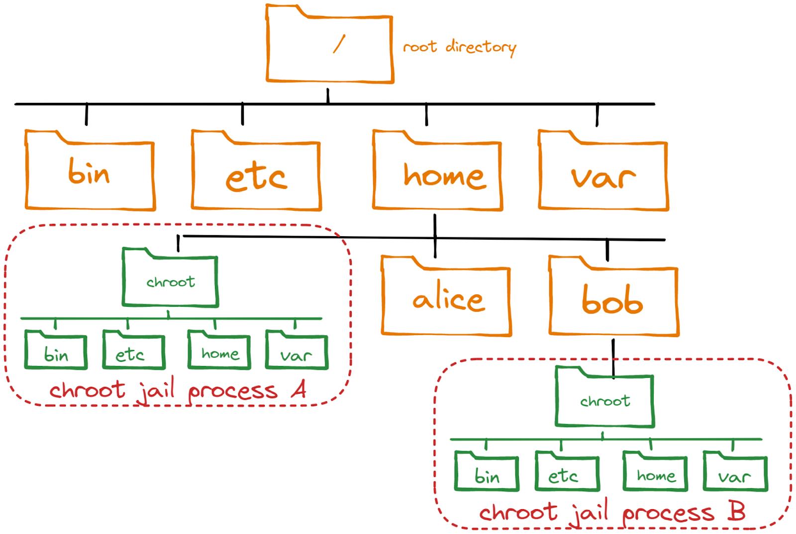
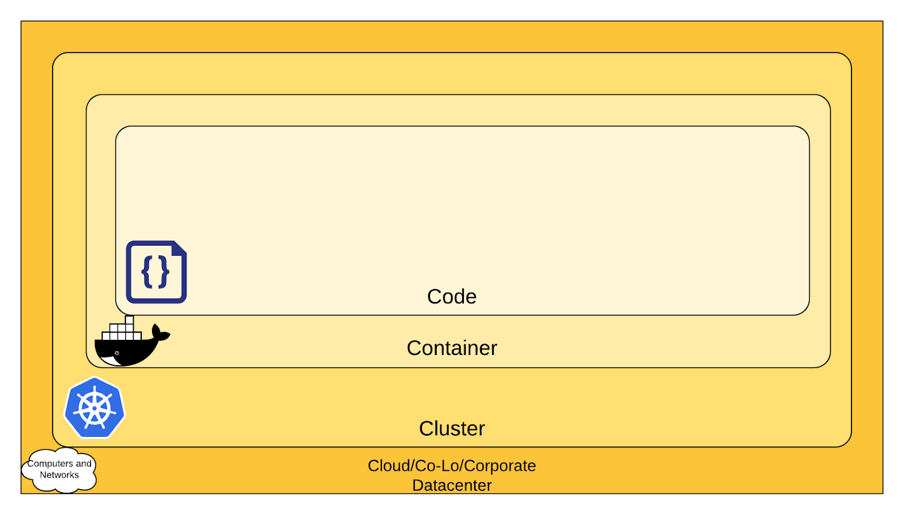

# Container Orchestration - 22%
This part of the repository demonstrates the **Container Orchestration** part of exam objectives, which covers 22% of the KCNA exam.

---

## Chapter outcomes
After reading this page, you should be able to:
- Describe the concept of containers and their core components.
- Understand the underlying technologies on which containers are based.
- Explain Hhw to build a container.
- Describe which problems are solved by a container orchestration system.
- Explain the 4 C's of Cloud Native Security.

---
## What are containers?  
- Containerization is a method of packaging an application and its dependencies into a standardized portable unit that is a runnable entity.
- It is about encapsulating software, i.e., separating it from the Operating System (OS) via a file system. The encapsulated file system provides all the software (e.g., a specific version of OS, libraries, frameworks, etc.) that an application needs to run.
- Containers ensure the separation and management of resources used on a computer. This includes code, runtime modules, system tools, system libraries, and everything that can be installed on a computer. This guarantees that the software can always be executed regardless of the environment.

---

## The base technology of containers
Docker and other container solutions use a set of mechanisms that have been available in the Linux kernel for some time:
- Container technology is based on the concept of `Chroot` but in a modernized way.
- `Chroot` command, introduced in Version 7 Unix in 1979, isolates a process from the root filesystem. It hides the files from the process and simulates a new root directory.
- The isolated environment is called a `chroot jail` in which only files explicitly put in the new root filesystem are accessible by the process running in the `jail`.
- In 2013, Docker launched the building and running of containers but did not invent it. Docker stitched the existing technologies together intelligently to make containers more user-friendly and accessible.

    
- [A Brief History of Containers: From 1970 Till Now](https://blog.aquasec.com/a-brief-history-of-containers-from-1970s-chroot-to-docker-2016)

---

## What are container core components?
- **Container Registry:** a database of images to pull/push container images (e.g., DockerHub).
- **Container Image:** a template or blueprint from which you can create a container instance. In addition to the actual application, the container image contains a complete runtime environment, including the OS (without the kernel), libraries, utilities, and required files. As an OS, a maximally reduced base system without a service manager, such as system is sufficient.
- **Container:** a running instance of an image. You can create any number of containers from one image.
- **Container Network:** exists on the container host and connects containers with other containers and the outside world. There is a default network, but you can create as many networks as you want on the container host.
- **Container Engine:**  the software that takes care of deploying the containers on the container host. The container engine is mostly comparable to a hypervisor.
- **Container Host:** the machine that runs the container engine and containers.

---

## What is the difference between a container and a virtual machine (VM)?
- While a VM emulates a complete server, including the OS and a kernel, containers share the host machine's kernel and isolate only the processes.
- Containers use the host kernel and are bound to boot the host OS only and are processes running on the host system managed individually or in groups, while VMs allow for the installation of guest OS that may be different from the OS of the host system.
- When you start a container, it is docked to the kernel running on the host. The kernel then opens a new namespace and allocates the resources it needs.
- The container is just a running process that runs on a container host. You create a container (e.g., with an Apache web server) on a host, start it with any container engine (e.g., Docker), and let it run. When you delete the container, the entire web server is gone from the host.
- Imagine a server on which different apps should be installed, and each app needs and depends on a particular version of a framework, so the installation of both apps on the same server fails. Container technology allows running both applications on the server by using two containers with the correct versions of the framework. Even though you then have two containers, less storage space is required than with two separate VMs because there is no OS in the containers, only the different versions of the framework.

    

---

## How to build a container?
- A container is always created from an image.
- *“A Docker container image is a lightweight, standalone, executable package of software that includes everything needed to run an application: code, runtime, system tools, system libraries and settings.”* - ***Docker***.
- Container images are read-only and contain different layers, which include everything you have added during the build phase.
- An Image is built by reading the instructions from a build file called ***Dockerfile***. The instructions are almost the same as one would use to install an application on a server.
- The Docker daemon, the main component of the Docker engine, reads this Dockerfile and runs every instruction to assemble the image.
- A Dockerfile has the following instructions:
  - **Build time instructions**
    - `FROM`: initializes a new build stage and sets the Base Image for subsequent instructions.  
    - `LABEL`: adds metadata to the resulting image and stores it as a key-value string. You can specify multiple labels for an object, but each key-value pair must be unique within an object. 
    - `RUN`: will execute any commands in a new layer on top of the current image and commit the results.  
    - `WORKDIR`: sets the working directory for any RUN, CMD, ENTRYPOINT, COPY, and ADD  instructions that follow it.
    - `ADD`: copies new files, directories, or remote file URLs from <src> and adds them to the filesystem of the image at the path <dest>.
    - `COPY`: copies new files or directories from <src> and adds them to the container's filesystem at the path <dest>.
    - `EXPOSE`: informs Docker that the container listens on the specified network port(s).
    - `ENV`: sets environment variables inside the container, e.g., `ENV_WEB="192.168.2.3"`.
    - `VOLUME`: creates a mount point and mounts external storage on it, e.g., `VOLUME ["path/data"]`.
  - **Run time instructions**
    - `CMD`: executes when the container is started from the resulting image. There can only be one `CMD` in a Dockerfile, and if there is more than one only the last one is used.
    - `ENTRYPOINT`: allows to configure a container that will run as an executable.
- [Here is an example of how to build a container from a Dockerfile](https://github.com/Memal7/containerize-app)

---

## Which security instructions must be considered in container environments?
- Containers always share the kernel and network with the host --> becomes a risk for the whole system if containers are allowed to call kernel functions like, e.g., killing other processes or modifying the host network by creating routing rules.
- The execution of processes with too many privileges --> starting processes as root or admin
- Usage of public images in public container registries, e.g., DockerHub --> malicious software
- In general, security cannot be achieved only at the container layer. It is a continuous process that needs to be adapted all the time.
- The 4 C's of Cloud Native Security can give a rough idea of which layers need to be protected when you are using containers.

    

- [Dockerfile security best practices](https://sysdig.com/blog/dockerfile-best-practices/)

---

## What is a container orchestrator?
- Containers have become a standard for delivering microservice-based applications.
- Since a microservice-based application can have lots of containers, you must deploy and manage a large number of containers for each application. In this case, you are going to face very quickly to following problems:
  - Providing compute resources, like VM where containers can run on.
  - Scheduling containers to servers in an efficient way.
  - Allocating resources like CPU and memory to containers.
  - Managing the availability of containers and replacing them if they fail.
  - Scaling containers if load increases.
  - Providing networking to connect containers
  - Provisioning storage if containers need to persist data.
- In this case, you come very quickly to the point where you need an orchestration system to manage these containers and solve these problems in an automated way.
- A container orchestration system typically has the following tasks:
  - Self-healing of containers (e.g. restarting containers that fail or replacing containers)
  - Autoscaling (up/down) dynamically, based on demand
  - Automating rolling updates and rollbacks of containers
  - Managing storage to persist container's data
  - Managing network traffic and IP address management
- Container orchestration systems provide a way to build a cluster of multiple servers and host the containers within that cluster.
- Most container orchestration systems consist of two parts: a control plane (old name: master node) responsible for managing the containers and worker nodes that host the containers.
- Kubernetes is an open-source container orchestration software for automating deployment, scaling, and management of containerized applications. It is the industry's most established and widely used container orchestration system.
- K8s is mostly used as an abbreviation of Kubernetes, because there are 8 letters between K and s.

---

[Next Part ▶ Kubrnetes Fundamentals](./03_kubernetes-fundamentals.md)
