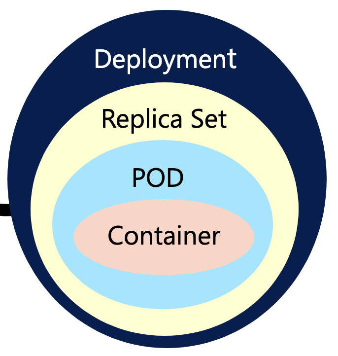
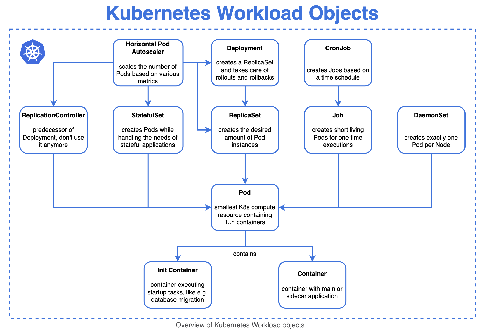
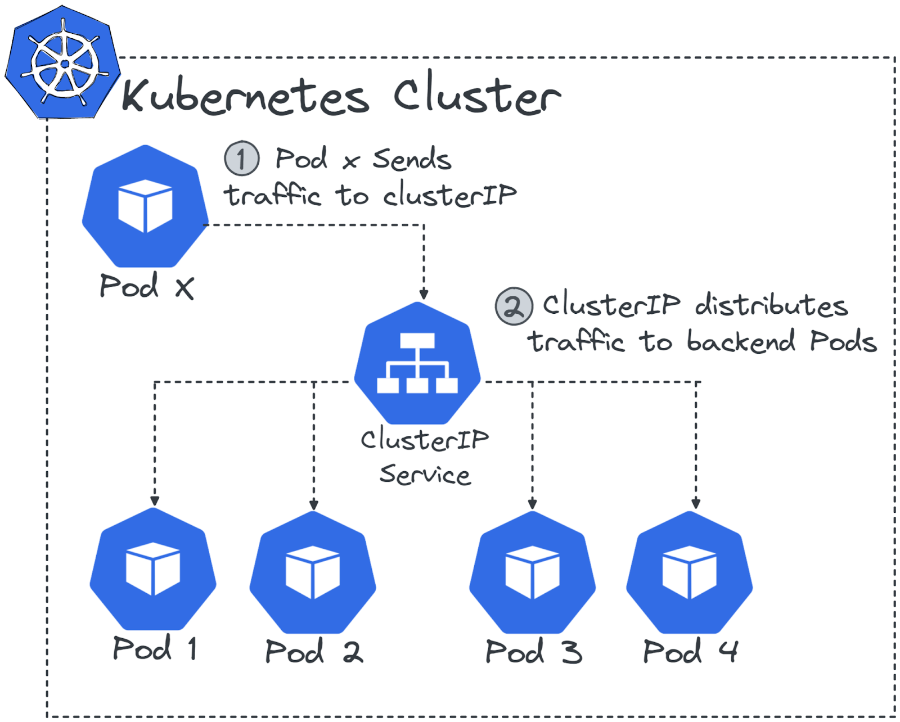
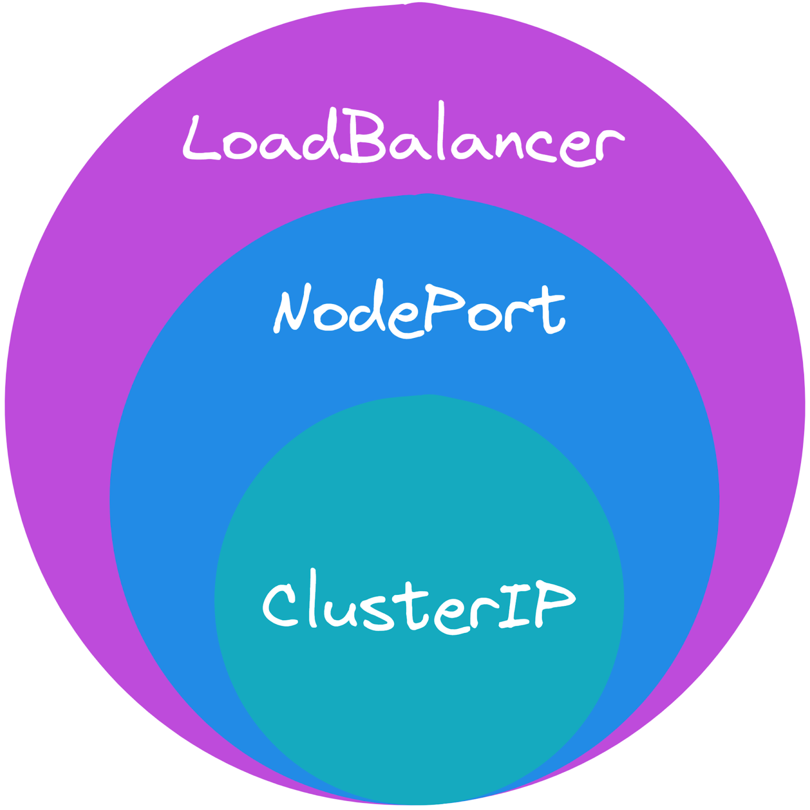
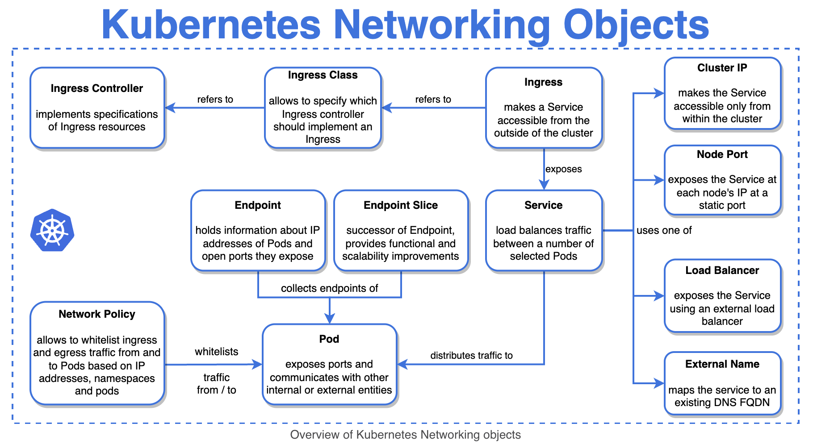
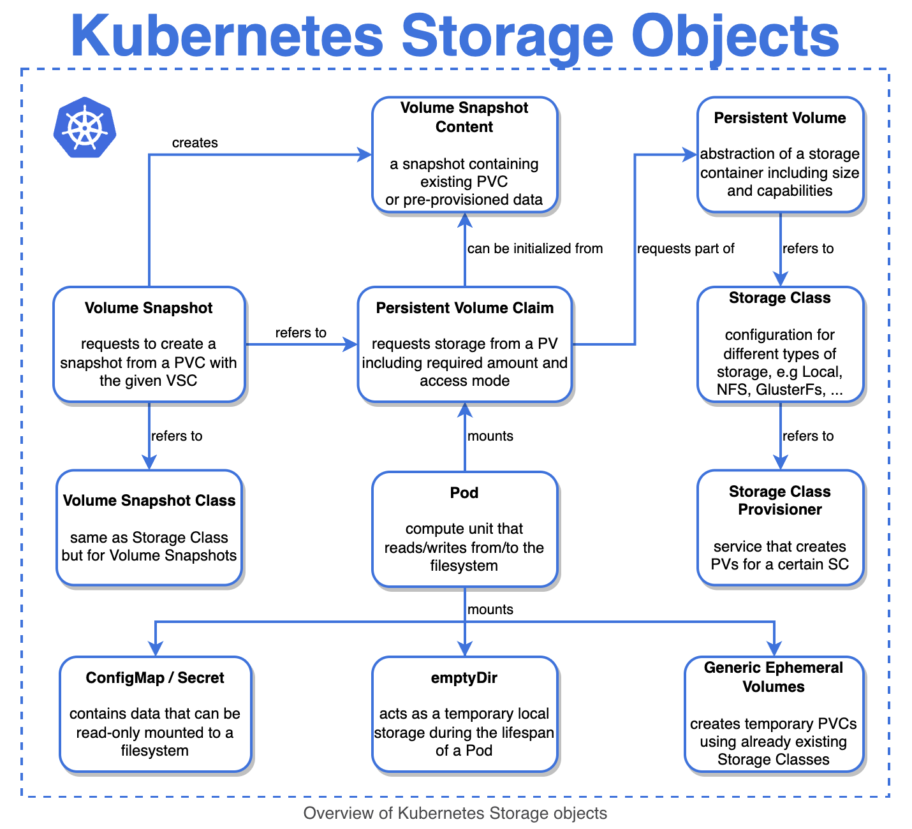

# Kubernetes Objects
This part of the repository demonstrate the **Kubernetes Objects** which is the part of [Kubernetes Fundamentals - 46%](./03_kubernetes-fundamentals.md).

---

## Chapter outcomes
- Describe the Kubernetes Objects and understand the task of every single object in much details and deep dive.

---

## What're Kubernetes (k8s) objects?
- K8s objects are a collection of primitives to represent the state of whole cluster and allow to configure (declarative or imperative) the state of the cluster.
- A k8s object is a "record of intent" - once you create the object, the k8s system will constantly work to ensure that object exists.
- By creating an object, you're effectively telling the k8s system what you want your cluster's workload to look like; this is your cluster's desired state.
- These objects describe how your workload should be handled and how to handle container orchestration issues like scheduling, self-healing, etc.
- Some core primitives K8s objects are:
    - **Pods:** where the containerized application instance run. 
    - **Controller:** keeps whole cluster in desired state (e.g. Deployments, ReplicaSet, etc.).
    - **Service:** provides a persistence access point to the containerized application inside Pods (e.g. Ingress, etc.).
    - **Storage:** provides persistence storage solution (e.g. Volume, PV, PVC, etc.).
- Objects can be described in YAML file and then send them to API Server, where going to be validated before they're created.
- An example k8s object declaration in YAML file looks like followings:
```
apiVersion: demo-app/v1 
kind: Deployment   
metadata:  
  name: nginx-deployment  
spec:  
  selector:  
    matchLabels:  
      app: nginx  
  replicas: 3  
  template:  
    metadata:  
     labels:  
       app: nginx  
    spec:  
      containers:  
       - name: sample-nginx-container  
          image: nginx:1.20  
          ports:  
           - containerPort: 80  
```
---

## Describe the concept and task of API Server.
- All communications between all k8s components are done through API Server and this where users would access the cluster.
- Without it, communication with the cluster is not possible!
- It's a `RESTful API` over `HTTP` or `HTTPS` using `JSON`.
- Before a request is processed by k8s, it has to go through three stages:
    - **Authentication:** The requester needs to present a means of identity to authenticate against the API. Commonly done with a digital signed certificate (X.509) or with an external identity management system. K8s users are always externally managed. Service Accounts can be used to authenticate technical users
    - **Authorization:** it is decided what the requester is allowed to do. In k8s this can be done with *Role Based Access Control (RBAC)*.
    - **Admission Control:** can be used to modify or validate the request. E.g., if a user tries to use a container image from an untrustworthy registry, an admission controller could block this request. Tools like the *Open Policy Agent* can be used to manage admission control externally.

---

## Describe Kubernetes Workload objects.
- **Pods:**
    - Pods are the smallest deployable compute unit in k8s and describes a unit of one or more containers that share an isolation layer of `namespaces` and `cgroups`.
    - In a Pod runs usually a single containerized application instance based on a container image, but can contain multiple containers, e.g. including util containers or logging containers.
    - All containers inside a Pod share an IP address and can share via the filesystem.
    - Pods are ephemeral - no Pod is ever re-deployed. If a Pod dies and re-deploy again based on a container image, no state is maintained between those deployments.
    - Pods are atomicity - if a container in a Pod dies, the Pod is unavailable, even for all containers in this Pod.
- **Controller:**
    - Controllers are control loops that watch the state of your cluster, then make or request changes where needed. Each Controller tries to move the current cluster state closer to the desired state.
    - K8s Pods have a defined lifecycle, e.g. a Pod is running in your cluster then a critical fault happens on the Worker Node where that Pod is running, means that all the Pods on that Worker Node fail. You need to create a new Pod to recover, even if the node later becomes healthy.
    - However you don't have to manage each Pod. To make sure that a defined number of Pod copies runs all the time, you can use Controller objects (e.g. Deployment, ReplicaSet, DaemonsSet, etc.) that make sure the right number of the right kind of Pod are always running, to match the desired state you specified.
- **ReplicaSet:**
    - ReplicaSet ensures a desired number of Pods are running at any given time.
    - Define the number of replicas for a particular Pod and make sure if one of the Pod becomes unavailable or unhealthy that you want to have up and running at all times.
    - ReplicaSet can be used to scale out applications and improve their availability. They do this by starting multiple copies of a Pod definition.
- **Deployment:**
    - Deployment manages the state of the ReplicaSet, e.g. things like which container image to run or numbers of Pods to create.
    - Deployment describes the complete application lifecycle by managing multiple ReplicaSets that get updated when the application is changed by providing a new container image.
    - A Deployment is an object that can represent an application running on your cluster. When you create the Deployment, you might set the Deployment spec to specify the number of replicas of the application to be running. The k8s system reads the Deployment spec and starts that desired number of instances of your application - updating the status to match your spec. If any of those instances should fail (a status change), the k8s system responds the difference between spec and status by making a correction - in this case, starting a replacement instance.
    - Deployments are perfect to run stateless applications in k8s.
    - **Deployment strategies:**
        - `recreate:` terminate the old version and release the new one
        - `Ramped (default):` release a new version on a rolling update fashion, one after the other
        - `blue/green:` release a new version alongside the old version then switch traffic
        `canary:` release a new version to a subset of users, then proceed to a full rollout
        - `a/b testing:` release a new version to a subset of users in a precise way (HTTP headers, cookies, weight, etc.).  

        
- **StatefullSet:**
    - StatefulSets can be used to run statefull applications like databases on k8s.
	- Stateful applications have special requirements that don't fit the ephemeral nature of Pods and containers.
    - In contrast to Deployments, StatefulSets try to retain IP addresses of Pods and give them a stable name, persistent storage and more graceful handling of scaling and updates.
- **DaemonSet:**
    - DaemonSet object ensures that a copy of a Pod runs on all (or some) Worker Nodes of your cluster.
    - DaemonSets are perfect to run infrastructure-related workload, e.g. monitoring or logging tools.
- **Job:**
	- Job object creates one or more Pods that execute a task and terminate afterwards.
    - Job objects are perfect to run one-shot scripts like database migrations or administrative tasks.
- **CronJobs:**
	- CronJobs add a time-based configuration to jobs.
    - This allows running jobs periodically, e.g. doing a backup job every night at 4am.

### An overview of Kubernetes Workload objects with short description of every components.



---

## Describe Kubernetes Networking (Services) objects.
- **Services and Ingress objects tasks:**
    - Services are the networking abstraction for access to the services that Pods actually provide.
    - Services can be used to expose a set of Pods as a network service.
    - Suppose that you have a service running in a Pod that you would like to make available to the other clients running in the cluster. Every Pod gets an IP address. In every k8s cluster, all Pods have to be able to reach any other Pods. So, we could simply let every client know our Pod IP address, and they would be able to reach us.
    - Of course, that’s not a very effective method. Pods can come and go, especially Pods that are managed by a Deployment. In Deployments, Pods are considered to be identical replicas that can be scaled up and down or replaced due to crashing or application upgrades. Each time a Pod is destroyed and recreated, a new IP address is allocated. We can't expect IP addresses to be stable in this environment. Additionally, if there are multiple Pods providing the service, we would need to communicate all of those addresses as they come and go.
    - K8s solves this problem with a Service resource. This resource combines a load-balancing configuration, a way to select Pods that provide the Service, and a name.
- **ClusterIP:**
    - ClusterIP creates a stable, cluster-wide virtual IP (VIP) address for a Service, and associate it with a name. All Pods providing a Service are given specific labels, and the Service is provided with a selector for those labels. The selector is used to select Pods and group them into Endpoints resources, which contain all of the addresses and ports of those resources.
    - This service type can be used as a round-robin load balancer.
    
- **NodePort:**
	- The NodePort service type extends the ClusterIP by adding simple routing rules.
    - It opens a port (default between 30000-32767) on every Worker Node in the cluster and maps it to the ClusterIP.
    - This service type allows routing external traffic to the cluster.
- **LoadBalancer:**
	- The LoadBalancer service type extends the NodePort by deploying an external LoadBalancer instance.
	- This will only work if you’re in an environment that has an API to configure a LoadBalancer instance, like GCP, AWS, Azure or even OpenStack.
- **ExternalName:**
	- A special service type that has no routing whatsoever.
	- ExternalName is using the k8sinternal DNS server to create a DNS alias.
	- You can use this to create a simple alias to resolve a rather complicated hostname like: `my-dbs-az1-uid6498.cloud-provider.com`
    - This is especially useful if you want to reach external resources from your k8s cluster.


### An overview of Kubernetes Networking (Services) objects with short description of every components.


---

## Describe Kubernetes Storage objects.
- **Describe the concept of persistent storage in k8s:**
    - Containers are not designed with persistent storage in mind, especially when that storage spans across multiple nodes.
    - Containers already had the concept of mounting volumes, but since in k8s you’re not working with containers directly, k8s made volumes part of a Pod, just like containers are.
    - Volumes allow sharing data between multiple containers within the same Pod. This concept allows for great flexibility when you want to use a sidecar pattern. The second purpose they serve is preventing data loss when a Pod crashes and is restarted on the same node. Pods are started in a clean state, but all data is lost unless written to a volume. So the problem with this concept is, that the volume is dependent of the Pod!
    - Here’s an example of a hostPath volume mount that is similar to a host mount introduced by Docker:  
    ```
    apiVersion: v1
    kind: Pod
    metadata:
    name: mypod
    spec:
    containers:
     - image: k8s.gcr.io/test-webserver
    name: test-container
    volumeMounts:
     - mountPath: /test-pd
        name: test-volume
    volumes:
     - name: test-volume
    hostPath:  # directory location on host
        path: /data  # this field is optional
        type: Directory
    ```  

    - But a cluster environment with multiple servers requires even more flexibility. So in this case, you can use cloud block storage like Amazon EBS, Google Persistent Disks, Azure Disk Storage.
	- To make the user experience more uniform, k8s is using the Container Storage Interface (CSI) which allows the storage vendor to write a plugin (storage driver) that can be used in k8s.
	- To use this abstraction, you have two more objects that can be used:
		- **PersistentVolumes (PV):** It's a Pod independent storage that's defined by admin at cluster level. The object configuration holds information like type of volume, volume size, access mode and unique identifiers and information how to mount it.
    - **PersistentVolumeClaims (PVC):** A request for storage by a user. If the cluster has multiple persistent volumes, the user can create a PVC which will reserve a persistent volume according to the user's needs, e.g. in Pod definition you can say, you want 10GB of this type of storage.
### An overview of Kubernetes Storage objects with short description of every components.


---

## Describe Kubernetes Configuration objects.
- **Usage and benefits of Configuration objects:**
    - It is considered as a bad practice to incorporate the configuration directly into the container build. Any configuration change would require the entire image to be rebuilt and the entire container or Pod to be redeployed. This problem gets only worse when multiple environments (dev, staging, prod) are used and images are being built for each and every environment.
    - In k8s, this problem is solved by decoupling the configuration from the Pods with a ConfigMap object.
- **ConfigMaps:**
    - ConfigMaps can be used to store whole configuration files or variables as key-value pairs.
    - There are two possible ways to use a ConfigMap:
        - Mount a ConfigMap as a volume in Pod
        - Map variables from a ConfigMap to environment variables of a Pod.
    - Here is an example of a ConfigMap that contains a nginx configuration:
        ```
        apiVersion: v1
        kind: Pod
        metadata:
          name: nginx-config
		data:
		  nginx.conf: |
		    user nginx;
		    worker_processes 3;
            error_log /var/log/nginx/error.log;
        ...
        	  server {
		        isten     80;
		        server_name _;
		        location / {
		          root   html;
                  index  index.html index.htm; } } }

        ```
    - Once the ConfigMap is created you can use it in a Pod:
        ```
		apiVersion: v1
		kind: Pod
		metadata:
		  name: nginx
		spec:
		  containers:
		   - name: nginx
		    image: nginx:1.19
		    ports:
		     - containerPort: 80
		    volumeMounts:
		     - mountPath: /etc/nginx
		      name: nginx-conf
		  volumes:
		    - name: nginx-conf
		    configMap:
              name: nginx-conf
        ```

---
## Describe Kubernetes CAutoscaling objects.
- **Horizontal Pod Autoscaler (HPA):**
    - Adding more physical or virtual machines.
    - It's the most used autoscaler in k8s and scales the number of running Pods  in a cluster.
    - The HPA can watch Deployments or ReplicaSets and increase the number of Replicas if a certain threshold is reached.
    - Imagine your Pod can use 500MiB of memory and you configured a threshold of 80%. If the usage is over 400MiB (80%), a second Pod will get scheduled. Now you have a capacity of 1000MiB. If 800MiB is used, a third Pod will get scheduled and so on.
    - HPA scaling calculations can also use custom or external metrics. Custom metrics target a marker of Pod usage other than CPU usage, such as network traffic, memory, or a value relating to the Pod’s application. External metrics measure values that do not correlate to a Pod. For example, an external metric could track the number of pending tasks in a queue.
- **Cluster Autoscaler:**
    - The cluster autoscaler can add new Worker Nodes to the cluster if the demand increases. The Cluster Autoscaler works great in tandem with HPA.
    - Dynamically scaling the number of Worker Nodes to match current cluster utilization can help manage the costs of running k8s clusters on a cloud provider platform, especially with workloads that are designed to scale to meet current demand.
    - The Cluster Autoscaler checks the cluster for Pods that can't be scheduled on any existing nodes because of inadequate CPU or memory resources or because the Pod’s node affinity rules or taint tolerations do not match an existing node.
- **Vertical Pod Autoscaler (VPA):**
    - Adding more CPU and memory to existing VMs.
    - VPA allows Pods to increase and decrease the resource requests and limits dynamically. Vertical scaling is limited by the Worker Node capacity.
- **Kubernetes-based Event Driven Autoscaler (KEDA):**
    - KEDA can be used to scale the k8s workload based on events triggered by external systems.
    - Similar to the HPA, KEDA can scale Deployments, ReplicaSets, Pods, etc., but also other objects such as k8s jobs.
    - With a large selection of out-of-the-box scalers, KEDA can scale to special triggers such as a database query or even the number of pods in a k8s cluster.
    - For more details look at to the [Keda Concept](https://keda.sh/docs/2.8/concepts/)
