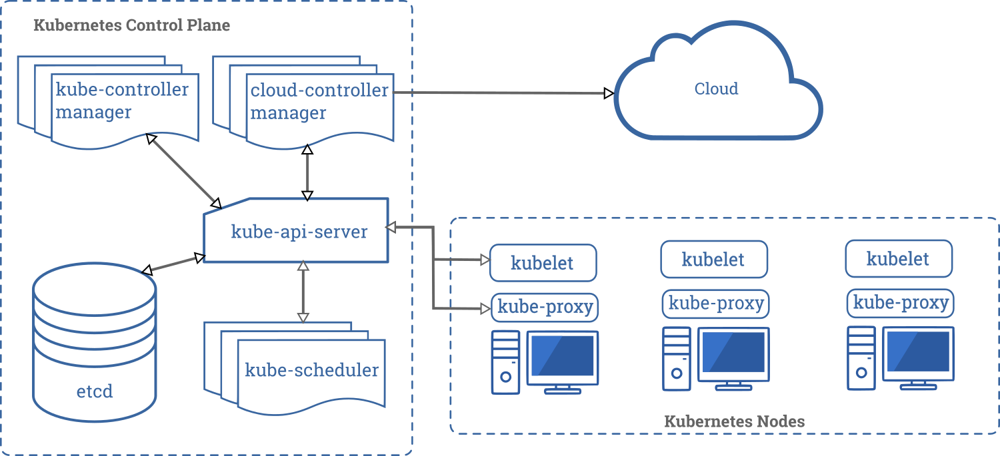
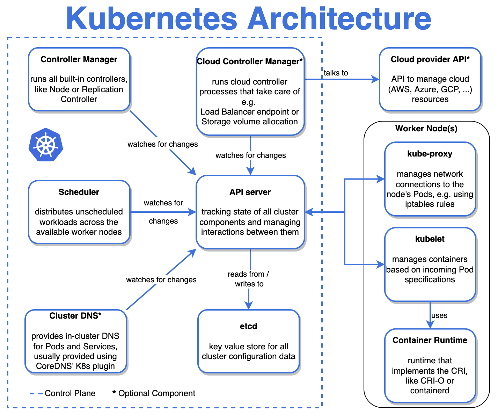

# Kubernetes Fundamentals - 46%
This part of the repository demonstrates the **Kubernetes Fundamentals** part of exam objectives, which covers 46% of the KCNA exam. First, it explains the Kubernetes architecture and after that the Kubernetes objects.  
For clarity, this part is split into two separate files: this one and [Kubernetes APIs](./03.1_kubernetes-objects.md).

---

## Chapter outcomes
After reading this page, you should be able to:
- Describe the Kubernetes architecture and understand the task of each component in detail.

---

## Kubernetes (k8s) architecture components

A k8s cluster consists of two different server nodes to run a containerized application:  

### Control Plane Node
This is the brain of operations and administration tasks. It is a collection of Linux machines (must be!) and contains various components which manage the cluster and control various tasks like deployment, scheduling, and self-healing of containerized workloads.  
These components are:
- **API Server**
  - Primary access point and communication hub for the whole k8s cluster.
  - All the communication between the components in k8s is done through this.
  - API and this is where users would access the cluster.
  - Without it, communication with the cluster is not possible.
  - API server itself is stateless, state of the system is stored in etcd.
- **etcd**
  - A database that stores the state of k8s objects in key-value pairs.
  - Every activity (e.g., assigning a container to a node etc.) in the k8s cluster going to be stored here.
- **Scheduler**
  - Describes the process of automatically choosing the right worker node for newly created or unassigned pods but is not responsible for actually starting the workload!
  - Before assigning a pod to a node, the existing nodes must be filtered according to specific scheduling requirements. A node that meets the scheduler requirements is called a *feasible node*. If none of the nodes are feasible, the pod remains unscheduled until the scheduler can place it.
  - Scheduler selects a node for the pod in a two-step operation:
    - **Filtering** finds feasible nodes for a pod, runs a set of functions to score the feasible nodes, and picks the node with the highest score among the feasible ones. The scheduler then notifies the API server about this decision in a process called *binding*.
    - **Scoring** the scheduler ranks the remaining nodes to choose the most suitable pod placement. The scheduler assigns a score to each node that survived filtering, basing this score on the active scoring rules.
  - Finally, the Scheduler assigns the pod to the node with the highest score. If there is more than one node with the same score, kube-scheduler selects one of these arbitrarily.
  - Factors that need to be taken into account for scheduling decisions include individual and collective resource requirements, hardware, software, policy constraints, data locality, etc.
- **Controller Manager**
  - It has the responsibility of keeping things in the desired state.
  - E.g., one of these control loops can make sure that the desired number of replicas for your application is available all the time.
- **Cloud Controller Manager (optional)**
  - Can be used to interact with the API of cloud providers to create external resources like load balancers, storage, or security groups.

### Worker Node
A worker node is a single machine (physical or virtual), and it can be either Linux or Windows. This is where the containerized applications run.  
Inside a worker node pods are running, and inside the pods run one or more containers.

A worker node has the following components:
- **Pod**
  - A pod is the smallest compute component within the k8s cluster.
  - Insider a pod there is usually a single containerized application instance based on an image. However, a pod can contain multiple containers including, e.g., *utility containers* or *logging containers*.
- **Container Runtime**
  - Is the underlying software that runs containers on a k8s cluster.
  - It is responsible for pulling, running, starting, and stopping container images.
  - Popular runtimes are *containerd*, *CRI-O*, or *Docker* (Docker is deprecated in k8s 1.20 and will be removed in k8s 1.23! [Here](https://kubernetes.io/blog/2020/12/02/dont-panic-kubernetes-and-docker/) is why.)
- **kubelet**
  - A small agent that runs on every worker node and makes sure that containers are running in a pod.
  - Is responsible for starting up pods on the worker node.
  - It monitors the API server for changes and is also responsible for the pod lifecycle.
  - The kubelet takes a set of `PodSpecs` that are provided through various mechanisms and ensures that the containers described in these `PodSpecs` are running and healthy.
  - The kubelet does not manage containers that were not created by k8s.
- **kube-proxy**
  - Responsible for pod networking and implementing service objects (service and ingress) abstraction on each worker node.
  - It ensures that each pod has a unique IP address.
  - It also implements rules to handle routing and load balancing of traffic by using *iptables* (default) and *IPVS*.
  - Kube-proxy makes networking available for your application.

---

### An overview of Kubernetes Architecture with a short description of every component.

---

[Next Part ▶ Kubernetes APIs](./03.1_kubernetes-objects.md)

