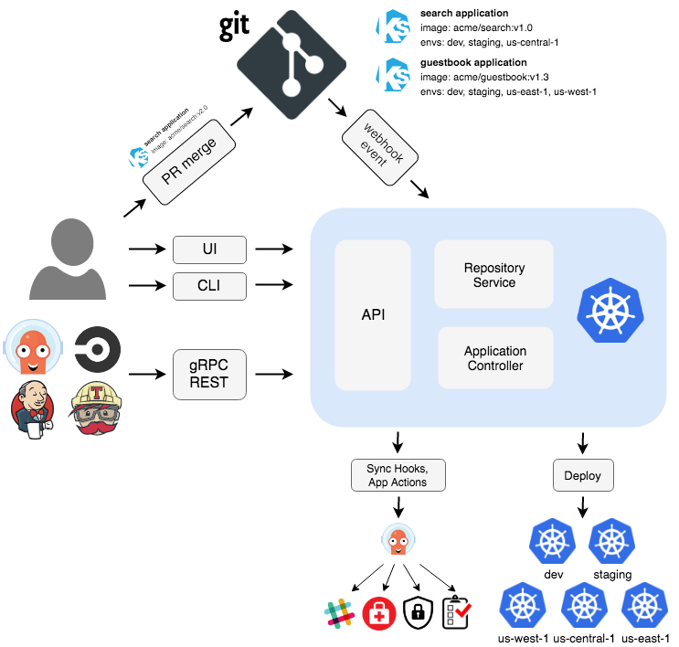

# Cloud Native Application Delivery - 8%
This part of the repository demonstrates the **Cloud Native Application Delivery** part of exam objectives, which covers 8% of the KCNA exam.

---

## Chapter outcomes
At the end of this page you should be able to describe and answer the following questions:
- Describe and understand the concept of CI/CD.
- Describe and understand the concept of GitOps.
- How GitOps workflow looks like and which benefits it has?
- Which GitOps frameworks are available and understand the concept of each of them?

---

## Describe the concept of Continuous Integration/Continuous Delivery (CI/CD).
- **CI:** describes the permanent building and testing of the written code.
- **CD:** automates the deployment of the pre-built software.
- **CI/CD Pipelines:** are scripted from all the steps involved, running on a server or in a container. Pipelines should be integrated with a version control system (e.g. Git) that manages changes to the code base. When a new version of your code is ready to be deployed, the pipeline executes scripts that build your code, run tests, deploy them to servers and even perform security and compliance checks.
- There are two different approaches to how a CI/CD pipeline can implement the changes you want to make:
    - **Push-based:** the pipeline is started and runs tools that make the changes in the platform. Changes can be triggered by a commit or merge request.
    - **Pull-based:** an agent watches the git repository for changes and compares the definition in the repository with the actual running state. If changes are detected, the agent applies the changes to the infrastructure.

---

## Describe the concept of Infrastructure as Code (IaC).
- IaC is the process of provisioning and managing infrastructure resources through writing and executing code, rather than using manual configuration or GUIs.  
- IaC offers many benefits. Just some of them are:
    - Provisioning the infrastructure resources in a automation, which is much faster and more consistent than manual.
    - Manage multiple environements (dev, stage, prod, etc.)
    - Repeatable usage of the IaC.
    - Versioning of IaC codes with version control (e.g. Git) and you can access always the old versions or update them.
    - IaC code can be used as a doc and anyone can access and understand it at any time.
    - ... and much more

---

## Describe the principles of GitOps and how it integrates with Kubernetes.
- GitOps takes the idea of Git as the single source of truth a step further and integrates infrastructure provisioning and change processes with version control operations.
- There are two examples of popular GitOps frameworks that use the pull-based approach are and *ArgoCD* and *Flux*.
- ArgoCD is implemented as a k8s controller, while Flux is built with the GitOps Toolkit, a set of APIs and controllers that can be used to extend Flux or even create a custom delivery platform.
- K8s is particularly well suited for GitOps since it provides an API and is designed for declarative provisioning and changes of resources right from the beginning.
- K8s is using a similar idea as the pull-based approach: A database is watched for changes, and the changes are applied to the running state if it doesn’t match the desired state.

    

---

[Next Part ▶ 05_Cloud Native Observability](./05_cloud-observability.md)