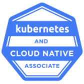

# Kubernetes and Cloud Native Associate (KCNA)
This repository demonstrates the exam objectives of KCNA certification. It explains the entire exam objectives in detail with examples, as well as a model test.
This repository should be as a single learning and preparation source for your KCNA exam. If you learned and understand all contents of this repository well, you're going to rock it ;).

---

## About KCNA certification

KCNA is the first and fundamentals certification of the CNCF (Cloud Native Computing Foundation). It provides a conceptual understanding of cloud-native architecture and most common used cloud-native projects, Microservices, Serverless Computing, Autoscaling, CI/CD, Observability, but as a core topic the Container and Kubernetes fundamentals in detail.

It's a multiple choice and true/false exam, which contains 60 questions and should be solved within 90 minutes.

---

## Who should learn this repo?
- If you want to have a broad understanding about cloud-native tecgnologies.
- if you just started your career in cloud-native world or newly switched in this environments.
- Students and graduates, which would like to kick-off thier carrer in cloud-native environments.
- And of course if you're interested to be certified KCNA.

---

## Exam objectives
    1. Cloud-Native Architecture - 16%
        a. Autoscaling
        b. Serverless
        c. Community and Governance 
        d. Roles and Personas
        e. Open Standards
        
    2. Container Orchestration - 22%
        a. Container Orchestration Fundamentals 
        b. Runtime
        c. Security
        d. Networking
        e. Service Mesh
        f. Storage
        
    3. Kubernetes Fundamentals - 46%
        a. Kubernetes Resources
        b. Kubernetes Architecture
        c. Kubernetes APIs
        d. Containers
        e. Scheduling
        
    4. Cloud-Native Application Delivery - 8%
        a. Application Delivery Fundamentals
        b. CI/CD
        c. GitOps
        
    5. Cloud-Native Observability - 8%
        a. Telemetry & Observability
        b. Prometheus
        c. Cost Management

---

## References
These references are just as a source of this repository. For your exam you shouldn't need these, this repository should be more than enough.
- [Linux Foundation Free Trainings](https://training.linuxfoundation.org/resources/?_sft_topic_area=cloud-containers&_sft_content_type=free-course)
- [Kubernetes Docs](https://kubernetes.io/docs/concepts/)